# 🛡️ Enterprise SIEM Implementation — Elastic Stack 8.11


---

## 📌 Project Overview

This project documents the end-to-end design, deployment, and validation of a **production-grade Security Information and Event Management (SIEM)** environment built on the Elastic Stack (v8.11). It covers the full security operations lifecycle:

- ✅ Infrastructure provisioning and centralised agent management via **Elastic Fleet**
- ✅ Multi-source log ingestion normalised to the **Elastic Common Schema (ECS)**
- ✅ Adversarial simulation using **Hydra** (SSH brute-force, MITRE ATT&CK T1110.001)
- ✅ **KQL-based detection rule** with metric threshold alerting and IP attribution
- ✅ Dual-audience **role-based dashboards** (SOC Analyst & Executive/Management)
- ✅ Critical reflection covering detection trade-offs, evasion limitations, and **UK GDPR governance**

> 📄 **[Download the full project portfolio document →](./SIEM_Personal_Project_Toochukwu_Praise_Ajoku.pdf)**

---

## 🧱 Architecture

```
┌─────────────────────────────────────────────────────────┐
│                   ELASTIC FLEET (Control Plane)         │
│              Central Policy Orchestration               │
└───────────────────────┬─────────────────────────────────┘
                        │  Encrypted Agent Comms (mTLS)
                        ▼
┌─────────────────────────────────────────────────────────┐
│           Ubuntu 24.04 LTS — Monitored Endpoint         │
│  Elastic Agent → /var/log/auth.log + /var/log/syslog*   │
└───────────────────────┬─────────────────────────────────┘
                        │  ECS-Normalised Telemetry
                        ▼
┌─────────────────────────────────────────────────────────┐
│         Elasticsearch 8.11 — Data Lake                  │
│     Grok Parsing → Field Extraction → Indexing          │
└───────────────────────┬─────────────────────────────────┘
                        │
                        ▼
┌─────────────────────────────────────────────────────────┐
│              Kibana — Analytics & Alerting              │
│   KQL Detection Rules │ SOC Dashboard │ Mgmt Dashboard  │
└─────────────────────────────────────────────────────────┘

            ┌──────────────────────────┐
            │  Kali Linux — Attacker   │
            │  Hydra SSH Brute-Force   │
            │  IP: 172.20.10.5         │
            └──────────────────────────┘
```

---

## 🗂️ Project Structure

```
siem-elastic-stack-project/
│
├── README.md
├── SIEM_Personal_Project_Toochukwu_Praise_Ajoku.pdf     ← Full portfolio document
│
└── screenshots/
    ├── 01_elastic_stack_operational.png
    ├── 02_elastic_agent_installed.png
    ├── 03_kibana_discover_ingestion.png
    ├── 04_ecs_json_field_extraction.png
    ├── 05_field_statistics_indexing.png
    ├── 06_hydra_attack_execution.png
    ├── 07_failed_auth_log_entry.png
    ├── 08_kql_detection_rule.png
    ├── 09_threshold_rule_config.png
    ├── 10_alert_execution_proof.png
    ├── 11_soc_event_volume_chart.png
    ├── 12_soc_auth_failure_pie.png
    ├── 13_soc_kpi_high_risk_count.png
    ├── 14_soc_ufw_firewall_blocks.png
    ├── 15_soc_events_by_process.png
    ├── 16_mgmt_incident_trend.png
    ├── 17_mgmt_source_breakdown.png
    ├── 18_mgmt_error_sources_table.png
    └── 19_mgmt_system_health_gauge.png
```

---

## ⚙️ Tech Stack

| Component | Role |
|---|---|
| **Elasticsearch 8.11** | Data lake — ingestion, indexing, and search |
| **Kibana 8.11** | Analytics UI — dashboards, KQL, alerting |
| **Elastic Fleet** | Centralised agent policy management |
| **Elastic Agent** | Log collection on monitored endpoint |
| **Ubuntu 24.04 LTS** | Target server (monitored) |
| **Kali Linux** | Attacker node (adversarial simulation) |
| **Hydra** | SSH brute-force tool (MITRE T1110.001) |
| **Grok / ECS** | Log parsing and field normalisation |
| **KQL** | Detection query language |

---

## 🔍 Part 1 — SIEM Deployment & Data Ingestion

### Installation

```bash
# Install Elastic packages from local downloads
cd ~/Downloads
sudo dpkg -i elasticsearch-8.11.0-amd64.deb
sudo dpkg -i kibana-8.11.0-amd64.deb

# Initialise services
sudo systemctl daemon-reload
sudo systemctl enable --now elasticsearch.service
sudo systemctl enable --now kibana.service

# Generate Kibana enrollment token
sudo /usr/share/elasticsearch/bin/elasticsearch-create-enrollment-token -s kibana

# Validate cluster health
curl -u elastic:[password] -X GET https://localhost:9200/_cluster/health?pretty
```

### Agent Enrollment

```bash
sudo ./elastic-agent install \
  --fleet-server-es=https://localhost:9200 \
  --fleet-server-service-token=AAEAAWVsYXN0aWMvZmxlZXQtc2VydmVyL3Rva2VuL1RFNzgwNTM1ODc2Mjg6TU9ram5wcDlUcmFQMmlKUm01RDhwQQ \
  --fleet-server-policy=fleet-server-policy \
  --fleet-server-es-ca-trusted-fingerprint=793905feaa8aef75f783870fb4b0707d916dec91499a8142912a632213326d5a \
  --fleet-server-port=8220 \
  --install-servers
# Output: "Elastic Agent has been successfully installed." [15s]
```

### ECS Field Mapping — What Grok Extracts

Raw auth.log entry:
```
Failed password for chizzi from 172.20.10.5 port 54321 ssh2
```

Parsed ECS fields stored in Elasticsearch:
```json
{
  "user.name":     "chizzi",
  "source.ip":     "172.20.10.5",
  "event.outcome": "failure",
  "event.action":  "ssh_login",
  "process.name":  "sshd",
  "data_stream.dataset": "system.auth"
}
```

### Log Sources Monitored

| Dataset | Log Path | Security Purpose |
|---|---|---|
| `system.auth` | `/var/log/auth.log*` | Authentication events — brute-force detection |
| `system.syslog` | `/var/log/syslog*` | OS-level forensics — post-exploitation activity |
| `elastic_agent.fleet_server` | *(internal)* | Sensor integrity — detects agent tampering |

### Screenshots

| Fig 1 — Elastic Stack Operational | Fig 2 — Elastic Agent Successfully Installed |
|---|---|
| 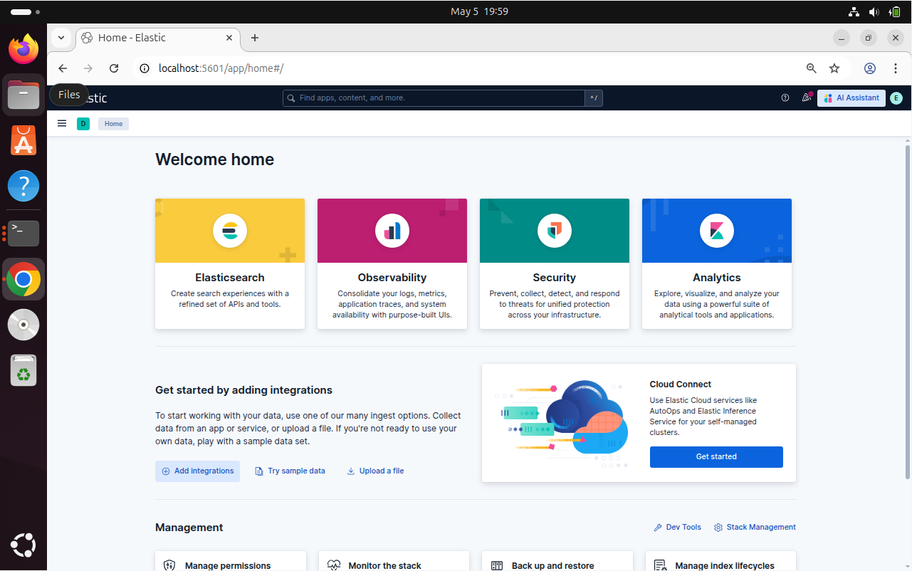 | 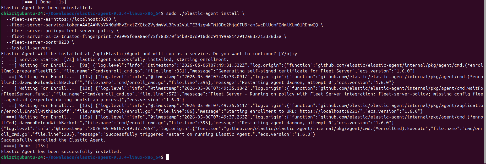 |

| Fig 3 — Multi-Source Ingestion (Discover) | Fig 4 — ECS Field Extraction (JSON) |
|---|---|
| 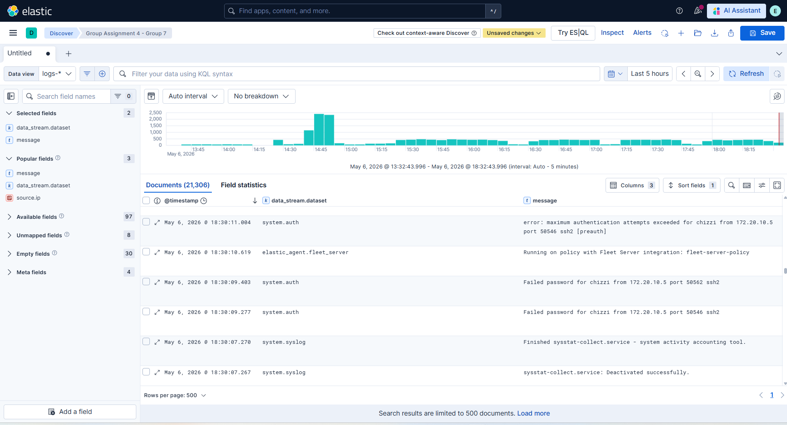 | 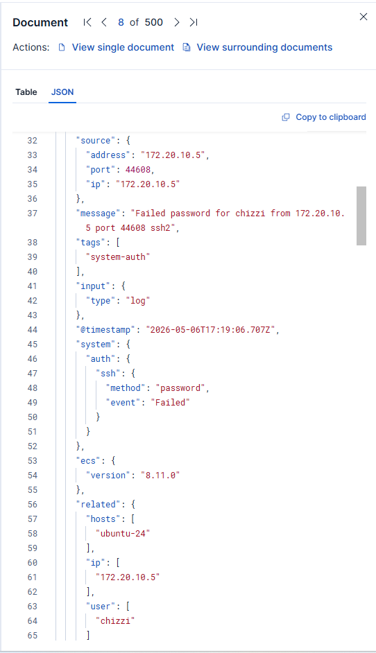 |

| Fig 5 — 100% Indexing Confirmed |  |
|---|---|
| 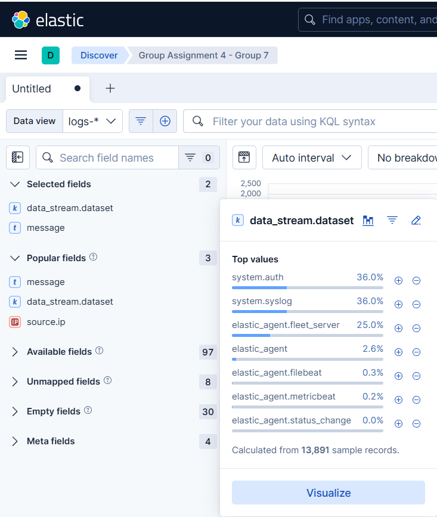 | |

---

## ⚔️ Part 2 — Detection Engineering & Alert Logic

### Adversarial Simulation

```bash
# Hydra SSH brute-force — MITRE ATT&CK T1110.001
sudo hydra \
  -l chizzi \
  -P /usr/share/wordlists/metasploit/unix_passwords.txt \
  -t 1 -W 5 \
  ssh://192.168.56.101
```

> **Flags:** `-t 1` (single thread) and `-W 5` (5-second delay) simulate a rate-limited, patient adversary — deliberately testing the boundary of the detection threshold.

### Detection Rule — KQL

```kql
data_stream.dataset : "system.auth" AND event.outcome : "failure"
```

### Alert Logic

```
IF   event.outcome = "failure"
AND  source.ip frequency > 10 occurrences per minute
THEN trigger HIGH-severity alert
     grouped by source.ip
```

**Why this threshold?**
A legitimate user forgetting their password generates 1–3 failures. Hydra generates dozens per minute. The 10/min threshold sits comfortably above human error while reliably catching automated tooling — applying the *Compliance Budget* principle (Beautement, Sasse and Wonham, 2008).

### Screenshots

| Fig 6 — Hydra Attack in Execution | Fig 7 — Failed Auth Log Entry |
|---|---|
| 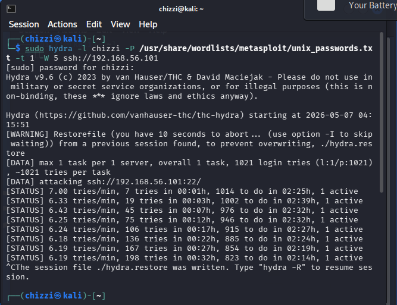 | 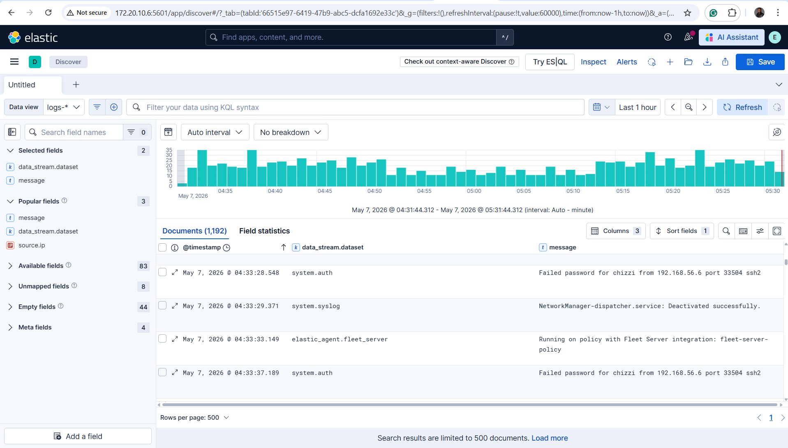 |

| Fig 8 — KQL Detection Rule Config | Fig 9 — Threshold Rule Config |
|---|---|
| 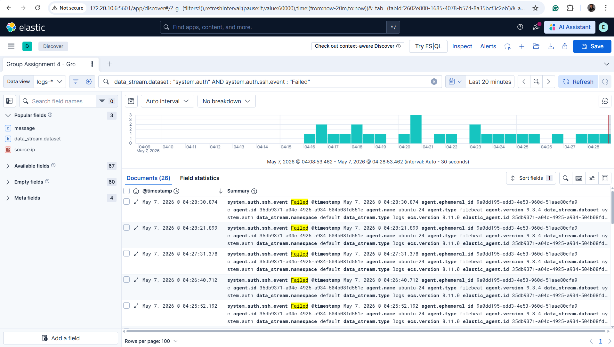 | 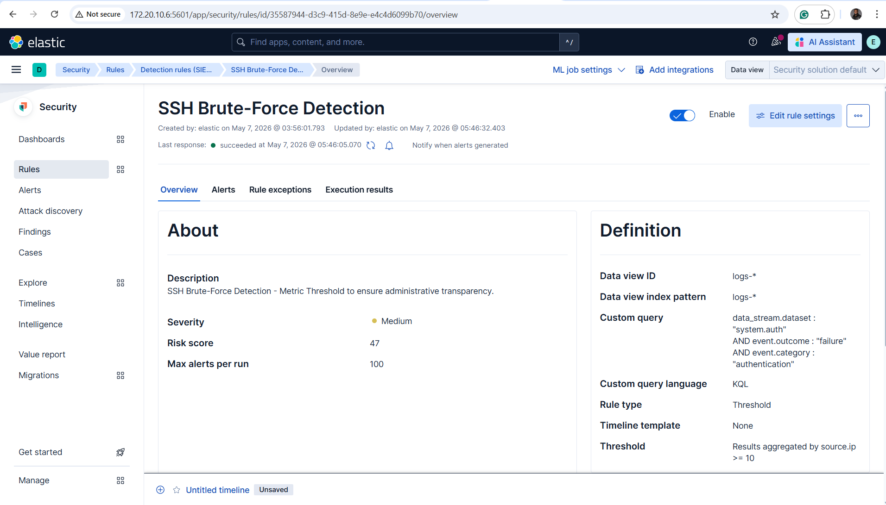 |

| Fig 10 — Live Alert: Adversary Attributed to 192.168.56.6 |  |
|---|---|
| 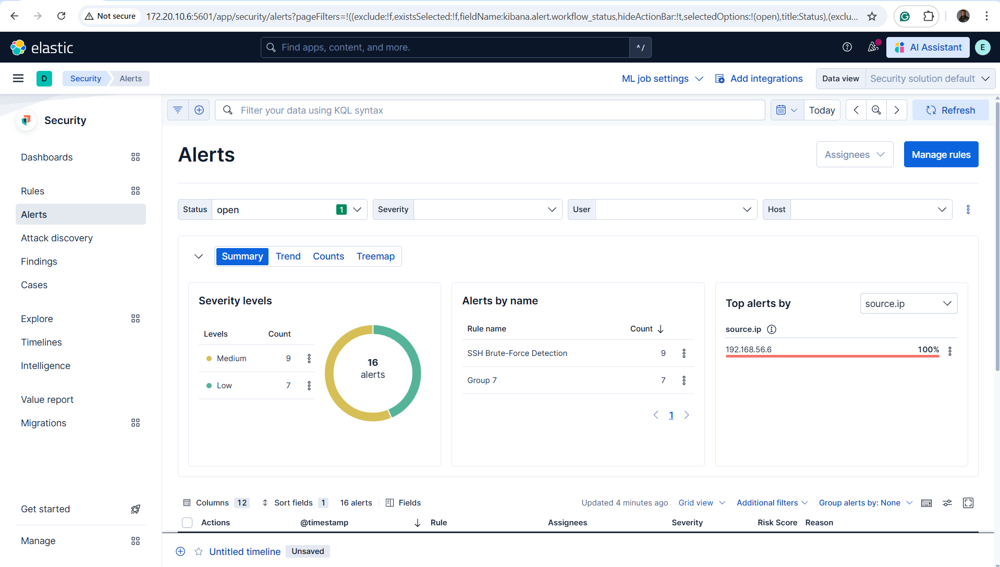 | |

---

## 📊 Part 3 — Role-Based Dashboards

Two distinct dashboards were built for different audiences:

### SOC Analyst Dashboard — Real-Time Threat Monitoring

| Visualisation | Type | Purpose |
|---|---|---|
| Event Volume Over Time | Stacked Bar | Identify spikes by dataset in real time |
| Failed vs Successful Auth | Pie Chart | Surfaces 99.95% failure rate instantly |
| High-Risk Event Count | KPI Tile | At-a-glance security health score (15,305 events) |
| Top IPs — UFW Firewall Blocks | Bar Chart | Identifies dominant blocked sources |
| Events by Process Name | Pie Chart | sshd (27.4%) + kernel (27.6%) = 55% of activity |

| Fig 11 — Event Volume | Fig 12 — Auth Failure Ratio |
|---|---|
| 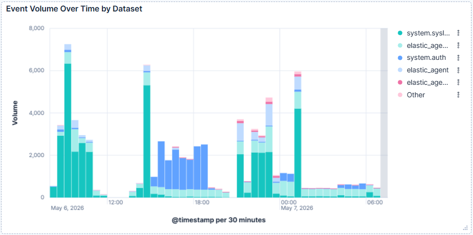 | 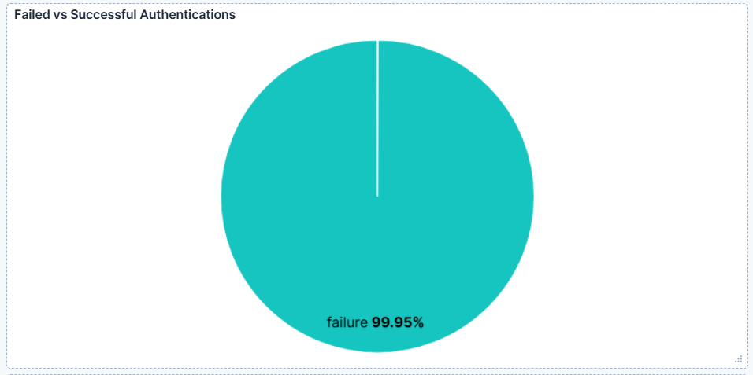 |

| Fig 13 — KPI Tile | Fig 14 — UFW Firewall Blocks |
|---|---|
| 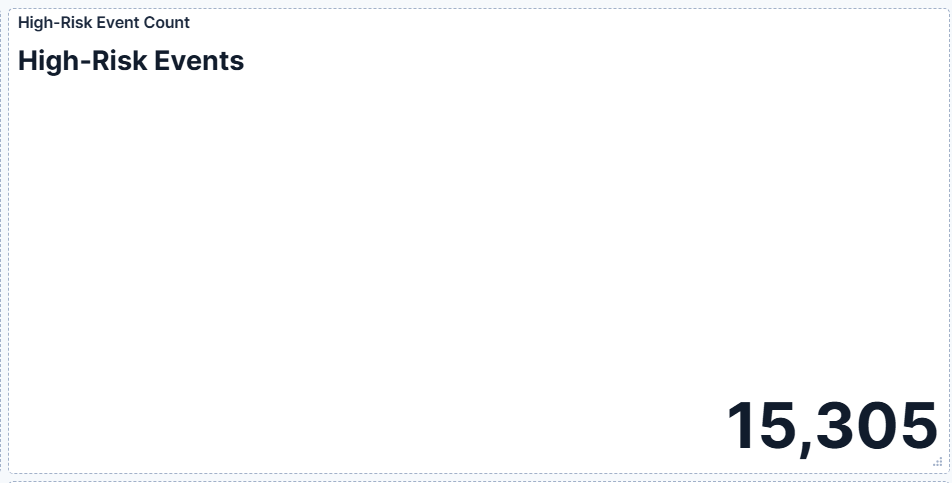 | 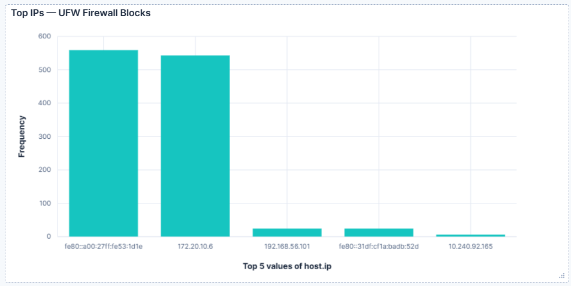 |

| Fig 15 — Events by Process |  |
|---|---|
| 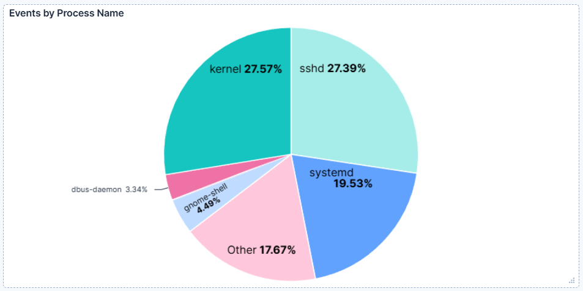 | |

---

### Management Dashboard — Strategic Risk Overview

| Visualisation | Type | Purpose |
|---|---|---|
| Security Incident Trend | Area Chart | Is our security burden stable or escalating? |
| Incident Source Breakdown | Pie Chart | Which category drives the security workload? |
| Most Frequent Error Sources | Data Table | sshd: 9,044 errors (18× next-ranked process) |
| System Health Indicator | Linear Gauge | Single-glance executive health summary |

| Fig 16 — Incident Trend | Fig 17 — Source Breakdown |
|---|---|
| 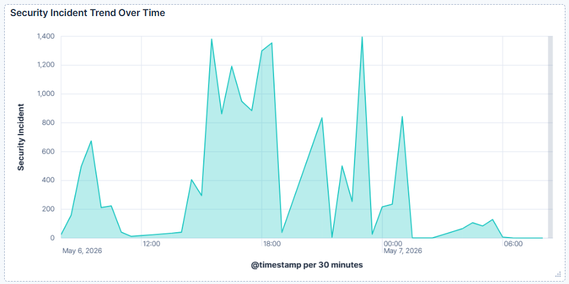 | 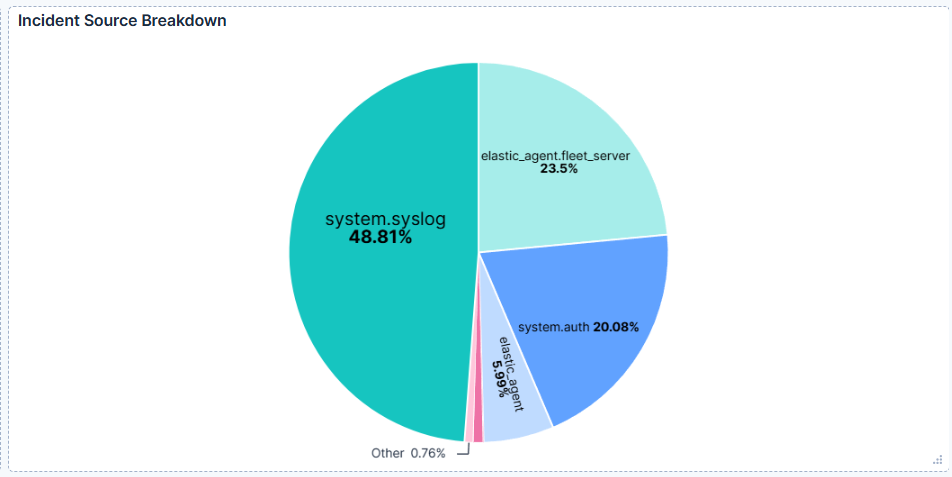 |

| Fig 18 — Error Sources Table | Fig 19 — System Health Gauge |
|---|---|
| 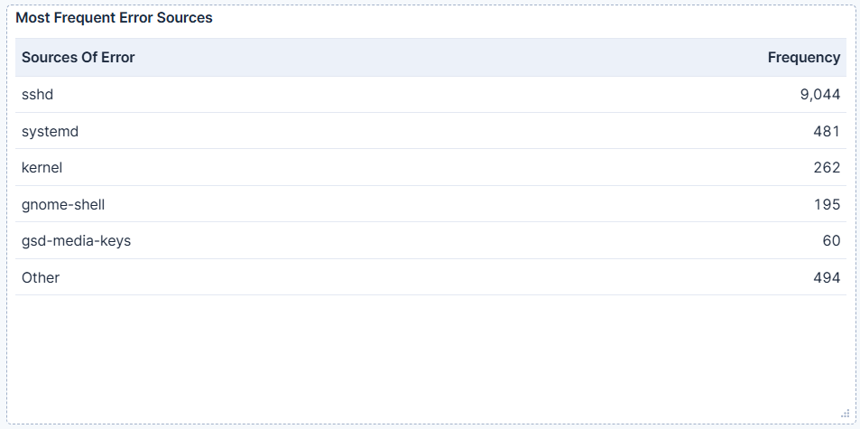 | 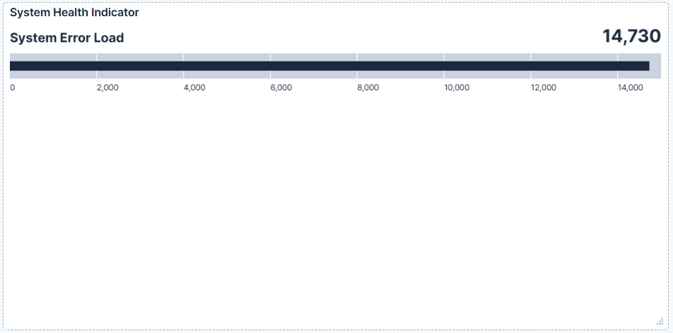 |

---

## ⚠️ Known Limitations & Future Work

| Limitation | Description | Planned Mitigation |
|---|---|---|
| **Low-and-slow evasion** | Attacker at 9 req/min indefinitely never triggers alert | Elastic ML anomaly detection on auth baseline |
| **Distributed brute-force** | Botnet across 500 IPs — no single IP exceeds threshold | Add `user.name`-grouped detection rule |
| **Contextual blindness** | Each 60s window evaluated in isolation | Stateful cumulative counter over longer windows |
| **UFW source IP parsing** | `host.ip` used as proxy; real attacker IP in raw message | Custom Grok ingest pipeline for UFW BLOCK events |
| **No automated response** | Alert fires but no automatic block triggered | SOAR integration → auto `iptables` block on confirmed alert |

---

## 🔒 UK GDPR & Governance Considerations

This project was designed with production deployment requirements in mind:

- `user.name` and `source.ip` are **personal data** under UK GDPR (Data Protection Act 2018)
- A **DPIA** would be required prior to any live deployment
- Monitoring must have a documented **lawful basis** (legitimate interests / legal obligation)
- **Role-based access controls** must restrict raw telemetry to authorised security personnel only
- Transparent staff communication is both a compliance and a practical security requirement — opaque monitoring causes circumvention (Hadlington, 2018; Zimmermann et al., 2024)

---

## 🧠 Frameworks & References Applied

| Framework / Reference | Application |
|---|---|
| **MITRE ATT&CK T1110.001** | Brute force simulation and detection mapping |
| **Elastic Common Schema (ECS)** | Field normalisation across all log sources |
| **NCSC Logging Guidance (2022)** | Architecture and monitoring scope decisions |
| **UK GDPR / DPA 2018** | Data governance and DPIA requirements |
| Ani et al. (2022) | Socio-technical modelling — adversary adaptation and monitoring ethics |
| Beautement, Sasse & Wonham (2008) | Compliance Budget — threshold calibration against human error rates |
| Halder & Ozdemir (2018) | ML/intelligent security — ECS normalisation and algorithmic detection need |
| Hadlington (2018) | Human factor — accidental insider behaviour vs automated threat distinction |
| Kainda, Flechais & Roscoe (2010) | Security/usability trade-off — threshold design and dashboard cognitive load |
| Melone (2021) | Security by Design — verifiable, maintainable monitoring architecture |
| Sasse & Flechais (2005) | Usable security — audience-matched dashboard design principles |
| Stallings & Brown (2018) | Authentication security, multi-source correlation, and defence-in-depth |
| Zimmermann et al. (2024) | Human-centred cybersecurity — staff surveillance ethics and circumvention risk |

---

## 👤 Author

**Toochukwu Praise Ajoku**
MSc Cyber Security — Keele University (2026)
Student Member, CIISec

[](https://www.linkedin.com/in/toochukwu-praise-ajoku/)

---

*This project was conducted in a controlled virtual lab environment. All adversarial activity was performed against systems I own and operate, strictly for educational and research purposes.*
